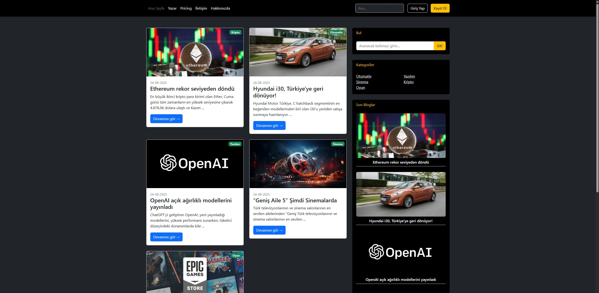
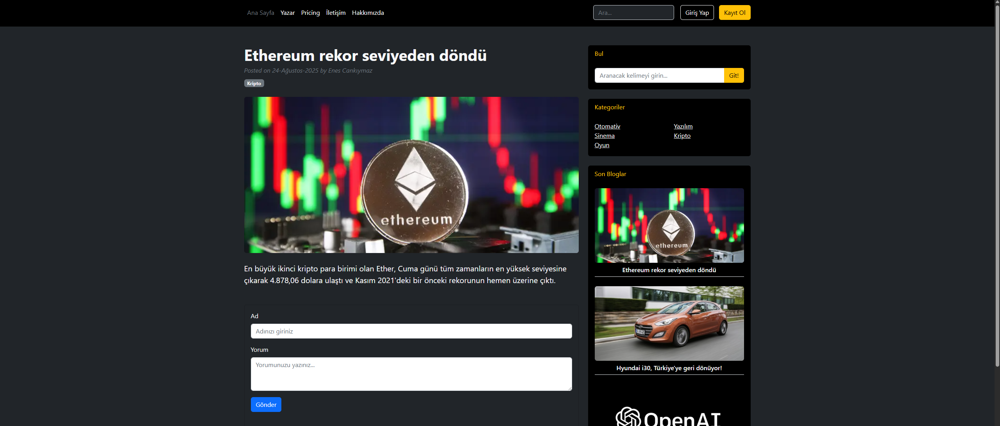
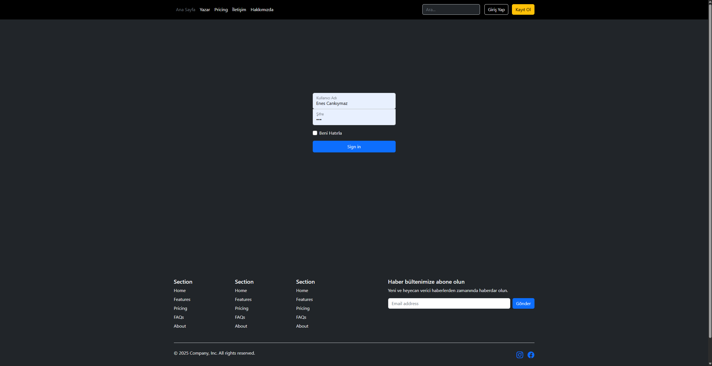
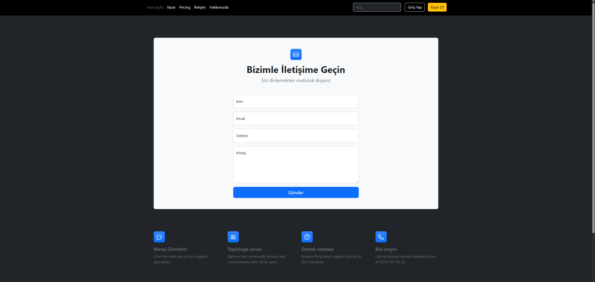

# 📰 Blog Website (ASP.NET Core MVC)

Bu proje, **ASP.NET Core 8.0**, **Entity Framework Core**, ve **Bootstrap 5.3** kullanılarak geliştirilmeye devam ettiğim bir blog sitesidir.  
Kullanıcıların blog yazılarını görüntüleyebildiği, yorum yapabildiği ve bültene abone olabildiği dinamik bir web uygulamasıdır.

---

## 🚀 Özellikler

- 🧍‍♂️ Kullanıcı **kayıt (Register)** ve **giriş (Login)** sistemi  
- 🔐 Kimlik Doğrulama (Authentication)
- 📝 **Blog gönderileri** listeleme ve detay sayfası  
- 💬 **Yorum ekleme** özelliği  
- 📧 **AJAX ile Bültene abone olma**  
- ⚡ **Bootstrap 5.3** tasarımı  
- 💾 **Entity Framework Core** ile veritabanı işlemleri  

---

## 🛠️ Kullanılan Teknolojiler

| **ASP.NET Core 8.0 (MVC)** 
| **Entity Framework Core** 
| **Bootstrap 5.3** 
| **AJAX / jQuery** 
| **HTML5 & CSS3** 
| **MS SQL Server** 

---

## 📸 Ekran Görüntüleri

> 
> 
> 
> 

---

