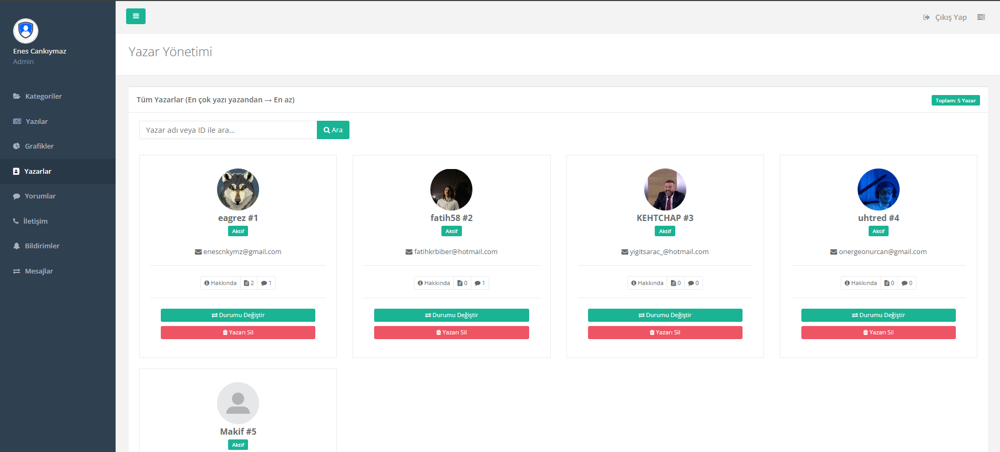

# 🎮 GameOn - İçerik ve Blog Portalı

Yönetim paneline sahip, N-Tier (Katmanlı) mimari ile inşa edilmiş ve dinamik bir ASP.NET Core MVC projesi.

🚀 **Canlı Demo:** [https://gameon.somee.com/](https://gameon.somee.com/)

## 📸 Ekran Görüntüleri

## 🏗️ Mimari ve Teknolojik Altyapı

* **Backend:** C#, ASP.NET Core 8.0 (MVC)
* **Veritabanı & ORM:** MS SQL Server, Entity Framework Core
* **Mimari:** N-Tier Architecture (Core, Data Access, Business, UI)
* **Frontend:** HTML5, CSS3, Bootstrap 5.3, JavaScript, AJAX
* **Harici Entegrasyonlar:** OpenWeather API, Döviz/Altın Kurları API

## ⚡ Performans ve Mühendislik Yaklaşımları
* **In-Memory Caching:** Dışarıdan çekilen anlık veriler, sunucuyu ve API kotalarını yormamak adına önbelleğe (Cache) alınarak optimize edilmiştir.
* **Görsel Optimizasyonu (WebP):** Sisteme yüklenen tüm blog ve kullanıcı görselleri arka planda otomatik olarak `.webp` formatına dönüştürülmüştür.
* **Asenkron İşlemler:** Sayfa yenilenmeden dinamik veri çekimi ve filtreleme işlemleri için AJAX tercih edilmiştir. View Component'ler ile UI parçalanarak tekrar kullanılabilirlik sağlanmıştır.

## 📌 Temel Özellikler

### 👤 Kullanıcı (UI) Tarafı
* Yazar, kategori veya anahtar kelimeye göre dinamik ve çoklu içerik filtreleme.
* API üzerinden anlık hava durumu ve finansal kur takibi.
* Blog yazma, düzenleme, yorum yapma ve iletişim modülleri.
* Bildirim ve mesaj sistemi.
* Yazar profilleri, profil düzenleme ,yazar istatistikleri takibi.

### 🛡️ Admin (Yönetim) Paneli

* **Gelişmiş Dashboard:** Google Charts entegrasyonu ile verilerin grafiksel analizi.
* **Tam Kontrol (CRUD):** Kategorilerin, blog yazılarının, yazarların, yorumların ve sistem mesajlarının/bildirimlerin tek bir merkezden yönetimi.

---

